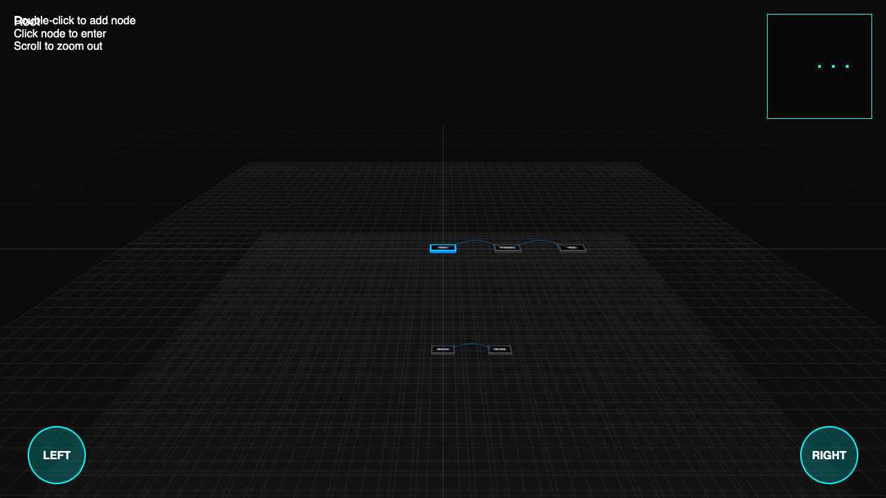
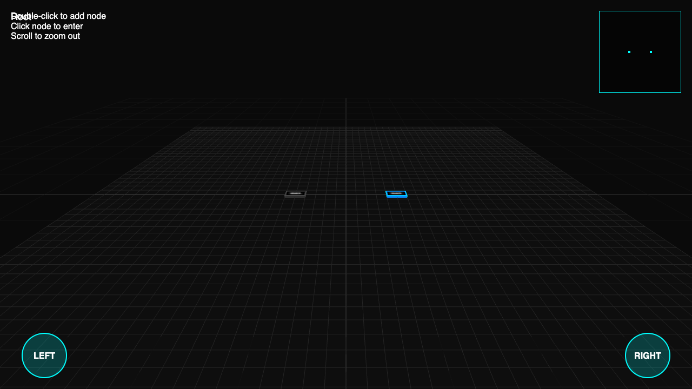

# DAG Viz v2.0 - Topic-Specific Test Results

Generated on: 2/8/2026, 5:37:30 PM

---

## Phase 1: Infrastructure & Environment (5:37:35 PM) - ✅

### Pixel Verification
BG: rgba(10, 10, 10, 255), Center: rgba(50, 50, 50, 255)

### Logs
```

🚀 Starting Step: Phase 1: Infrastructure & Environment
[5:37:33 PM] BROWSER: [log] [App] Initializing v2.0... http://localhost:3001/?error-ping&t=1770601053729
[5:37:33 PM] BROWSER: [log] [App] Error-ping detected, throwing error...
[5:37:33 PM] PAGE ERROR: Smoke Test Error
[5:37:34 PM] ✅ Step 0: Error-ping caught successfully
[5:37:34 PM] Navigating to http://localhost:3001/?t=1770601054314...
[5:37:34 PM] BROWSER: [log] [App] Initializing v2.0... http://localhost:3001/?t=1770601054314
[5:37:35 PM] GEOMETRY: Camera Pos: {"x":0,"y":30,"z":60}, Rot: {"x":-0.4636476090008062,"y":0,"z":0}
[5:37:35 PM] GEOMETRY: Node_0 WorldPos: {"x":0,"y":0,"z":0}, Emissive: 0x222222, Intensity: 0.5
[5:37:35 PM] 📸 Snapshot captured: final
```

### Screenshots


---
## Phase 2: Node & Layer Architecture (5:37:39 PM) - ✅

### Logs
```

🚀 Starting Step: Phase 2: Node & Layer Architecture
[5:37:39 PM] GEOMETRY: Camera Pos: {"x":0,"y":30,"z":60}, Rot: {"x":-0.4636476090008062,"y":0,"z":0}
[5:37:39 PM] GEOMETRY: Node_0 WorldPos: {"x":0,"y":0,"z":0}, Emissive: 0x222222, Intensity: 0.5
[5:37:39 PM] Nodes: 3, Ground: true, Labels: true
[5:37:39 PM] 📸 Snapshot captured: final
```

### Screenshots


---
## Phase 3: DAG Edge Rendering & Layout (5:37:43 PM) - ✅

### Logs
```

🚀 Starting Step: Phase 3: DAG Edge Rendering & Layout
[5:37:43 PM] Links: 2, Curved: true, Opacity: 0.5
[5:37:43 PM] Ranks: 0,1,2, X: 0,10,20
[5:37:43 PM] 📸 Snapshot captured: final
```

### Screenshots


---
## Phase 4: Interaction & Hover Logic (5:37:47 PM) - ✅

### Logs
```

🚀 Starting Step: Phase 4: Interaction & Hover Logic
[5:37:47 PM] Hovering node_0 at 640, 360
[5:37:47 PM] Intensity: 2, SubVisible: true
[5:37:47 PM] 📸 Snapshot captured: final
```

### Screenshots


---
## Phase 5: Navigation & Pathing (5:37:52 PM) - ✅

### Logs
```

🚀 Starting Step: Phase 5: Navigation & Pathing
[5:37:51 PM] Clicking to dive...
[5:37:52 PM] 📸 Snapshot captured: dived
[5:37:52 PM] Dive Result: Path=node_0, Y=-10
[5:37:52 PM] Scrubbing Up...
[5:37:52 PM] 📸 Snapshot captured: scrubbed_up
[5:37:52 PM] Scrub Up: PathLength=0
```

### Screenshots




---
## Phase 6: Advanced UI & HUD (5:37:56 PM) - ✅

### Logs
```

🚀 Starting Step: Phase 6: Advanced UI & HUD
[5:37:56 PM] UI: Breadcrumb="Root", Buttons=true, Minimap=true
[5:37:56 PM] 📸 Snapshot captured: final
```

### Screenshots


---
## Phase 7: Dynamic Node Hover Test (5:38:01 PM) - ✅

### Logs
```

🚀 Starting Step: Phase 7: Dynamic Node Hover Test
[5:38:00 PM] Action: Hovering Node A
[5:38:01 PM] 📸 Snapshot captured: hover_node_a
[5:38:01 PM] Action: Hovering Node B
[5:38:01 PM] 📸 Snapshot captured: hover_node_b
```

### Screenshots




---