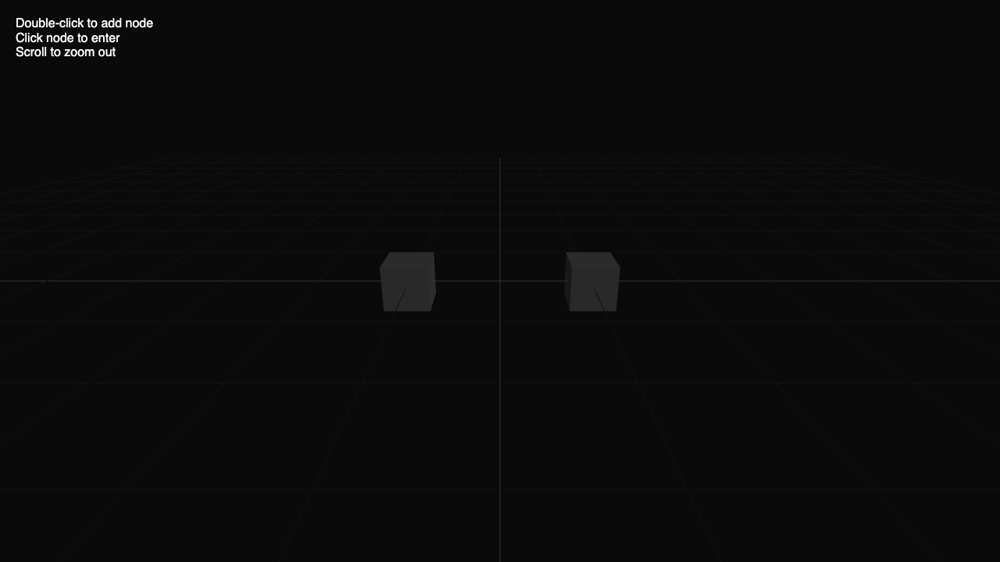
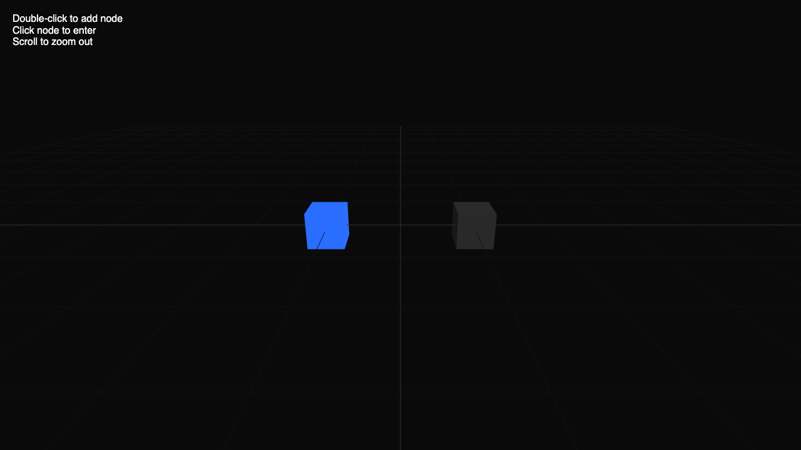
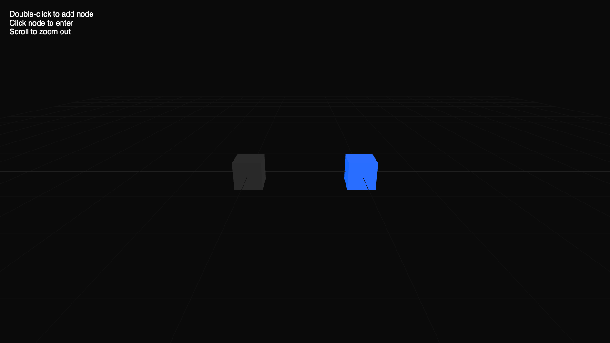

## 01 Initial Null State (7:13:01 PM) - ✅

### Logs
```

🚀 Starting Step: 01 Initial Null State
[7:13:00 PM] Navigating to http://localhost:3001...
[7:13:00 PM] BROWSER: [log] [v3-app] System ready. Current hover: null
[7:13:01 PM] 📸 Snapshot captured: initial_state
```

### Screenshots


---
## 02 Hover Node A (7:02:31 PM) - ✅

### Logs
```

🚀 Starting Step: 02 Hover Node A
[7:02:29 PM] Navigating to http://localhost:3001...
[7:02:29 PM] BROWSER: [log] [v3-app] System ready. Current hover: null
[7:02:30 PM] BROWSER: [warning] WARNING: Multiple instances of Three.js being imported.
[7:02:30 PM] BROWSER: [log] [v3-app] Hover change: node_A
[7:02:31 PM] 📸 Snapshot captured: hover_node_a
```

### Screenshots


---

---

## 03 Hover Node B (7:02:35 PM) - ✅

### Logs
```

🚀 Starting Step: 03 Hover Node B
[7:02:33 PM] Navigating to http://localhost:3001...
[7:02:34 PM] BROWSER: [log] [v3-app] System ready. Current hover: null
[7:02:35 PM] BROWSER: [warning] WARNING: Multiple instances of Three.js being imported.
[7:02:35 PM] BROWSER: [log] [v3-app] Hover change: node_A
[7:02:35 PM] BROWSER: [log] [v3-app] Hover change: node_B
[7:02:35 PM] 📸 Snapshot captured: hover_node_b
```

### Screenshots


---

---

## 04 Hover Exit (7:02:40 PM) - ✅

### Logs
```

🚀 Starting Step: 04 Hover Exit
[7:02:38 PM] Navigating to http://localhost:3001...
[7:02:38 PM] BROWSER: [log] [v3-app] System ready. Current hover: null
[7:02:39 PM] BROWSER: [warning] WARNING: Multiple instances of Three.js being imported.
[7:02:39 PM] BROWSER: [log] [v3-app] Hover change: node_A
[7:02:39 PM] BROWSER: [log] [v3-app] Hover change: null
[7:02:40 PM] 📸 Snapshot captured: hover_exit
```

### Screenshots


---

---

## 05 Hover Reentry (7:02:45 PM) - ✅

### Logs
```

🚀 Starting Step: 05 Hover Reentry
[7:02:43 PM] Navigating to http://localhost:3001...
[7:02:43 PM] BROWSER: [log] [v3-app] System ready. Current hover: null
[7:02:44 PM] BROWSER: [warning] WARNING: Multiple instances of Three.js being imported.
[7:02:44 PM] BROWSER: [log] [v3-app] Hover change: node_A
[7:02:44 PM] BROWSER: [log] [v3-app] Hover change: null
[7:02:44 PM] BROWSER: [log] [v3-app] Hover change: node_A
[7:02:45 PM] 📸 Snapshot captured: hover_reentry_a
```

### Screenshots


---

